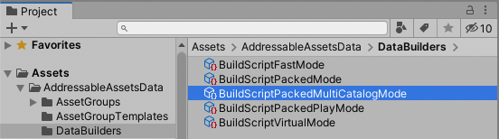
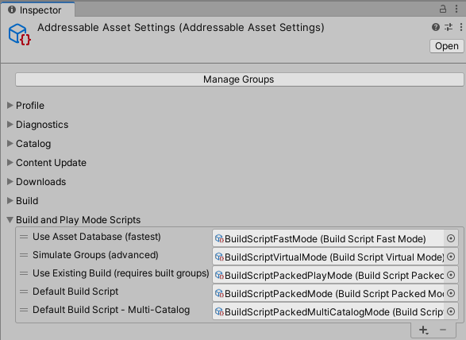
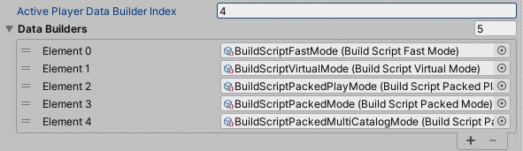
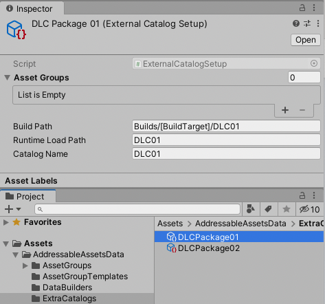

# Addressables - Multi-Catalog

The Addressables package by Unity provides a novel way of managing and packing assets for your build. It replaces the Asset Bundle system, and in certain ways, also seeks to dispose of the Resources folder.

This variant forked from the original Addressables-project adds support for building your assets across several catalogs in one go and provides several other benefits, e.g. reduced build times and build size, as well as keeping the buildcache intact.

This package currently tracks version `1.20.0` of the vanilla Addressables packages. Checkout a `multi-catalog` tag if you require a specific version.

**Note**: this repository does not track every available version of the _vanilla_ Addressables package. It's only kept up-to-date sporadically.

## The problem

A frequently recurring question is:

> Can Addressables be used for DLC bundles/assets?

The answer to that question largely depends on how you define what DLC means for your project, but for clarity's sake, let's define it this way:

> A package that contains assets and features to expand the base game. Such a package holds unique assets that _may_ rely on assets already present in the base game.

So, does Addressables support DLC packages as defined above? Yes, it's supported, but in a very crude and inefficient way.

In the vanilla implementation of Addressables, only one content catalog file is built at a time, and only the assets as defined to be included in the current build will be packed and saved. Any implicit dependency of an asset will get included in that build too, however. This creates several major problems:

* Each build (one for the base game, and one for each DLC package) will include each and every asset it relies on. This is expected for the base game, but not for the DLC package. This essentially creates unnecessary large DLC packages, and in the end, your running game will include the same assets multiple times on the player's system, and perhaps even in memory at runtime.
* No build caching can be used, since each build done for a DLC package is considered a whole new build for the Addressables system, and will invalidate any prior caching done. This significantly increases build times.
* Build caching and upload systems as those used by Steam for example, can't fully differentiate between the changes properly of subsequent builds. This results in longer and larger uploads, and consequently, in bigger updates for players to download.

## The solution

The solution comes in the form of performing the build process of the base game and all DLC packages in one step. In essence, what this implementation does is, have the Addressables build-pipeline perform one large build of all assets tracked by the base game and each of its DLC packages, and afterwards, extract the contents per defined DLC package and create a separate content catalog for each of them. Finally, Addressables creates the final content catalog file for the left-over asset groups, those that remain for the base game.

## Installation

This package is best installed using Unity's Package Manager. Fill in the URL found below in the package manager's input field for git-tracked packages:

> https://github.com/juniordiscart/com.unity.addressables.git

### Updating a vanilla installation

When you've already set up Addressables in your project and adjusted the settings to fit your project's needs, it might be cumbersome to set everything back. In that case, it might be better to update your existing settings with the new objects rather than starting with a clean slate:

1. Remove the currently tracked Addressables package from the Unity Package manager and track this version instead as defined by the [Installation section](#installation). However, __don't delete__ the `Assets/AddressableAssetsData` folder from your project!

2. In your project's `Assets/AddressableAssetsData/DataBuilders` folder, create a new 'multi-catalog' data builder:

   > Create → Addressables → Content Builders → Multi-Catalog Build Script

   

3. Select your existing Addressable asset settings object, navigate to the `Build and Play Mode Scripts` property and add your newly created multi-catalog data builder to the list.

   

4. Optionally, if you have the Addressables build set to be triggered by the player build, or have a custom build-pipeline, you will have to set the `ActivePlayerDataBuilderIndex` property. This value must either be set through the debug-inspector view (it's not exposed by the custom inspector), or set it through script.

   

### Setting up multiple catalogs

With the multi-catalog system installed, additional catalogs can now be created and included in build:

1. Create a new `ExternalCatalogSetup` object, one for each DLC package:

   > Create → Addressables → new External Catalog

2. In this object, fill in the following properties:
   * Catalog name: the name of the catalog file produced during build.
   * Build path: where this catalog and it's assets will be exported to after the build is done. This supports the same variable syntax as the build path in the Addressable Asset Settings.
   * Runtime load path: when the game is running, where should these assets be loaded from. This should depend on how you will deploy your DLC assets on the systems of your players. It also supports the same variable syntax.

   

3. Assign the Addressable asset groups that belong to this package.

4. Now, select the `BuildScriptPackedMultiCatalogMode` data builder object and assign your external catalog object(s).

   

## Building

With everything set up and configured, it's time to build the project's contents!

In your Addressable Groups window, tick all 'Include in build' boxes of those groups that should be built. From the build tab, there's a new `Default build script - Multi-Catalog` option. Select this one to start a content build with the multi-catalog setup.

## Loading the external catalogs

When you need to load in the assets put aside in these external packages, you can do so using:

> `Addressables.LoadContentCatalogAsync("path/to/dlc/catalogName.json");`
