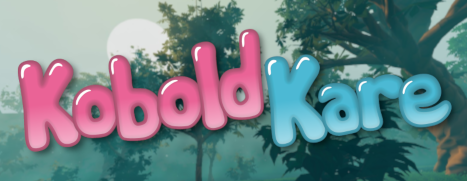

## A VR mod for KoboldKare

## Licensing

KoboldKare is made out of many parts, and each part may or may not be licensed to you.
Please read [LICENSE](LICENSE) to ensure you have license to do what you want with desired assets.

## Contributing

You can learn how to contribute to KoboldKare or VR Mod by reading [CONTRIBUTING.md](CONTRIBUTING.md)

## Additional info

If you prefer playing with mouse&keyboard in vr then you can toggle a seated mode in options. It removes controllers and snaps camera to bold's head.
Having issues with navigation in menus with controller? Known issue, wait for fix.
Wanna play with mods? Drag mod files from _Steam\steamapps\workshop\content_ into _LocalLow\Naelstrof\KoboldKare VR\mods_ folder.
